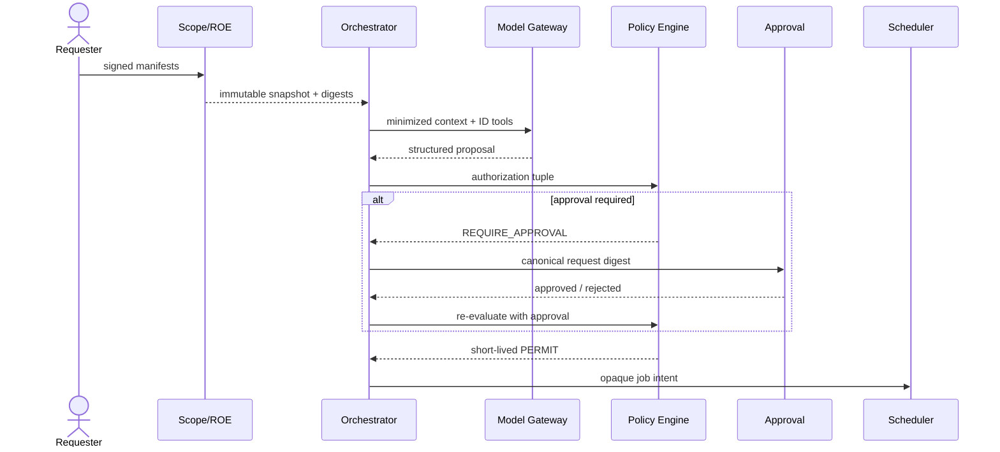

# Control plane design

## Responsibilities

The Control Plane converts authorized human intent into bounded, attributable execution grants. It never opens a direct session to a target and never treats model output as authority.

## Components

| Component | Responsibility | Security-critical behavior |
| --- | --- | --- |
| Agent Orchestrator | workflow state、model proposal、finding/patch loop | no arbitrary execution; pins all digests |
| Scope and ROE Service | validate/signature-check/snapshot manifests and catalogs | immutable generations; model read-only |
| Policy Engine | deterministic per-call authorization | OPA bundle pinned; unavailable=`INDETERMINATE`→deny |
| Human Approval Service | canonical request review and decision | content-bound、expiring、one-shot、SoD |
| Credential Broker | master secret/session issuance/proxy auth | no model/env/file exposure; immediate revoke |
| Job Scheduler | dispatch opaque intents and enforce concurrency | no secret/raw destination; idempotency key |
| Emergency Stop Service | stop fan-out independent of model | highest priority、one-purpose API、idempotent |
| Model Gateway | GPT-5.6 request/response mediation | minimized context、approved model/tools only |

## Internal service rules

- each service has a separate workload identity and database role
- no shared admin token or wildcard service account
- databases are logically and cryptographically separated: authorization store、workflow store、credential store
- Scope/ROE snapshots and policy bundles are immutable; active pointers are audited
- all inbound/outbound messages are schema versioned and signed or mTLS-authenticated
- health is a security dependency; stale/unavailable validation denies

## Model Gateway profile

An approved model profile contains:

- explicit model ID/snapshot allowlist
- API endpoint and organization/project binding
- `store=false` requirement and verified data-control posture
- permitted response/tool schemas only
- reasoning/verbosity/token/time/cost ceilings
- system/developer prompt digest
- disabled built-in tools list: hosted shell、web search、computer use、code interpreter、remote MCP
- redaction/transformation policy
- retry/refusal/error handling

`gpt-5.6-sol` is the current design candidate for quality-critical analysis, but production implementation requires a representative evaluation and explicit snapshot/version decision. Lower-cost family members may serve bounded classification only after separate validation; no silent router fallback.

## Workflow

## Data stores

| Store | Writer | Reader | Mutation model |
| --- | --- | --- | --- |
| Manifest snapshot | Scope Service only | Orchestrator/Policy | append new generation; no update |
| Policy bundle registry | Policy release service | Policy Engine | signed append/promote/rollback |
| Approval records | Approval Service | Policy/Orchestrator/Auditor | append decisions; no edit |
| Workflow state | Orchestrator/Scheduler | control services | state-machine CAS |
| Credential master | Broker only | Broker only | HSM/KMS governed |
| Audit queue | each producer append | OP exporter | append-only, bounded |

## Availability and fail-closed

- Policy/Scope/Approval/Broker dependency errors never become `permit`.
- HA replicas use quorum/consistency appropriate to authorization state; stale cache beyond signed TTL is invalid.
- Scheduler will not dispatch if OP ingest heartbeat、EP health、stop service、clock health are below threshold.
- Emergency Stop remains available on a separate priority channel; if unreachable, EP local watchdog performs quarantine.
- Recovery replays immutable events and verifies digests before resuming.

## Administrative boundaries

Control cluster administrators cannot read Broker master secrets or mutate OP evidence. Broker/HSM management is separate. Kubernetes, if used, hosts only control services; no Runner/range workloads, privileged pods, host sockets, wildcard RBAC, or public API endpoint.
