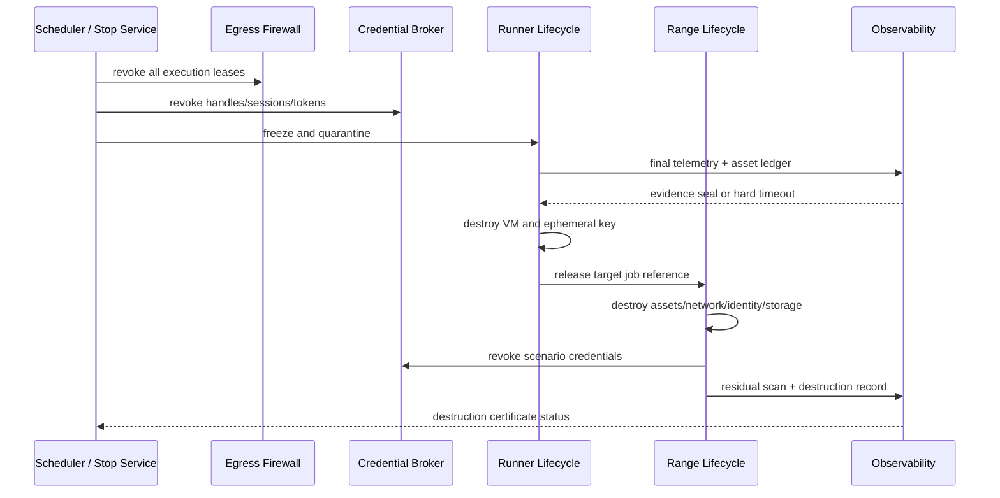

# Reset and destruction

## Objective

Every Runner and scenario is disposable. Teardown must remove environment state、credentials、tokens、keys、storage、snapshot、cache、network objects and name/identity state while preserving only separately governed evidence.

## Reset versus destroy

- `reset`: returns an approved reusable **template lineage** to a clean immutable baseline by destroying the instance and creating a new one. In-place cleanup is not trusted.
- `destroy`: removes the instance and all non-evidence derivatives permanently according to medium/provider guarantees.

No compromised or used Runner is reset for reuse. Range instances may only be re-instantiated from signed base artifacts.

## Asset ledger

At creation, Lifecycle Manager records expected resources:

- VM/microVM/container/target IDs and host allocation
- virtual network、switch、interface、route、firewall lease、DNS entry
- volume、snapshot、object、cache、queue/topic
- workload/target identity、certificate、token、credential handle
- PKI/IdP namespace and dummy accounts
- KMS DEK and wrapping key reference
- package/image layer and temporary registry objects
- sensor/tap and evidence correlation IDs

Destroy completion is evaluated against this ledger plus provider/host discovery; it is not based only on successful API responses.

## Sequence

Evidence capture has a bounded deadline. A stalled collector does not preserve network access; the asset stays quarantined until hard destruction.

## Cryptographic and physical deletion

- per-instance encrypted scratch and per-scenario data use unique DEKs
- DEK revoke/destroy is mandatory and independently confirmed
- discard memory state and disable hibernation
- delete snapshot/clone/volume/object/cache and provider backup references
- for media where crypto-shred is insufficient, apply approved sanitize/disposal standard
- evidence DEKs are separate and retained under OP policy

## Identity teardown

- revoke Broker handle、target session、token、certificate、synthetic user
- revoke workload certificate and remove identity mapping
- remove DNS、PKI、IdP、package mirror authorization namespace
- confirm replay of known handle/token fails
- rotate scenario-wide dummy credential if exposure is suspected

## Residual verification

Independent verifier checks:

- no expected or discovered compute/storage/network/identity object remains
- no firewall lease、route、DNS record、listener、queue item remains
- credential replay fails
- host has no writable layer/snapshot/memory dump
- package/cache namespace is empty
- evidence store contains only permitted evidence, no secret-bearing misclassified artifact
- inventory count is zero or explicitly retained with reason/owner/expiry

## Idempotency and failure

Destroy uses a stable operation ID and monotonic state. Repeated calls may advance but never recreate resources. Partial failure leaves state `QUARANTINED_DESTROY_PENDING`, network denied, credentials revoked, and pages Range/SRE. Manual cleanup is audited and followed by the same verifier.

## Destruction certificate

Append to OP:

- engagement/scenario/execution IDs
- template/image digests
- asset-ledger digest and zero-residual result
- credential revocation confirmations
- key destruction IDs/status
- start/end time and actor/workload identities
- failed/retried steps
- verifier version/digest
- retained evidence IDs/retention class

The certificate proves control execution, not mathematical erasure beyond storage/hardware guarantees. Those guarantees require human selection in Phase 02.
