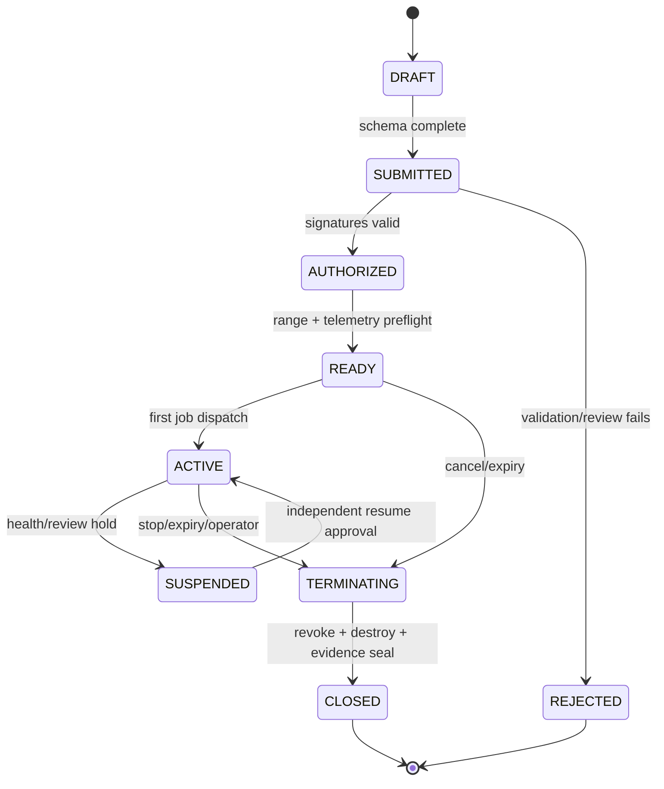
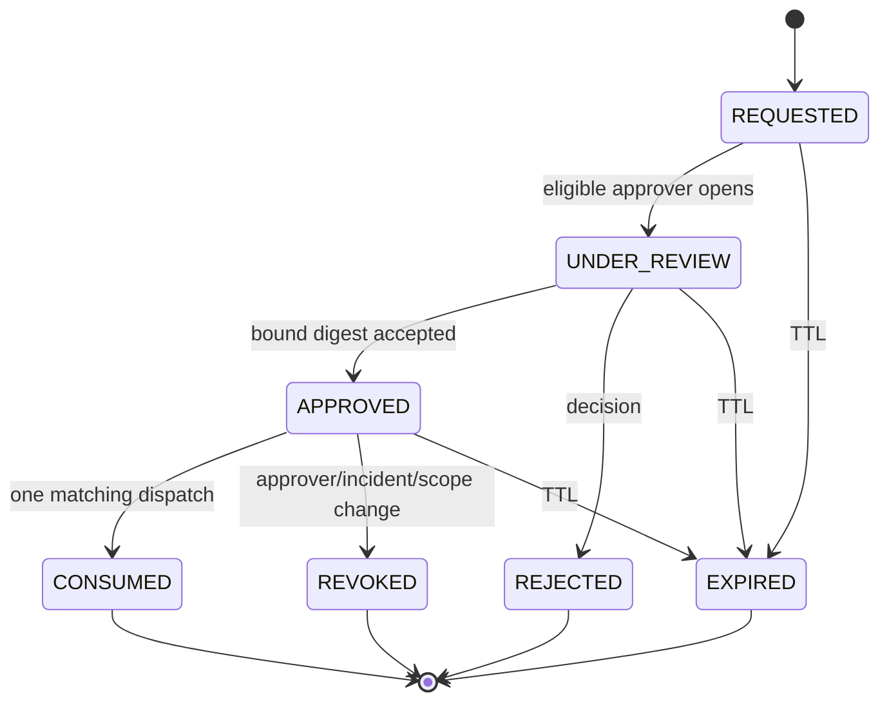
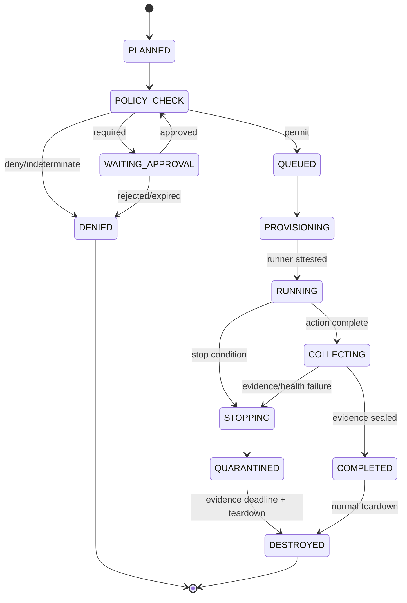
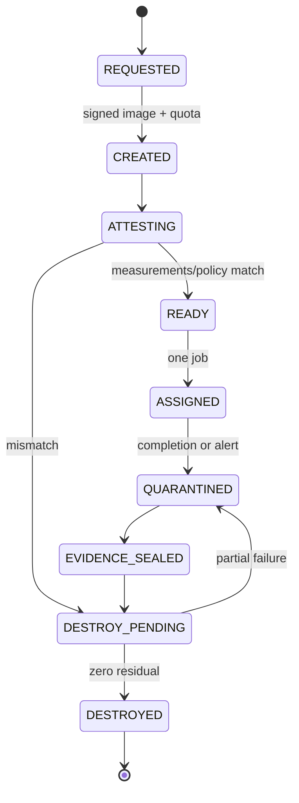

# State machines

All transitions use compare-and-set with idempotency key and append an audit event. Unknown or invalid transitions fail closed.

## Engagement

Scope expansion creates a new Engagement generation; it does not mutate `ACTIVE`.

## Approval

Parameter、target、tool、profile、budget、credential、scope/policy generation changes invalidate approval and require a new request.

## Job

## Runner lifecycle

Runner never returns from `ASSIGNED/QUARANTINED` to `READY`.

## Finding and patch loop

`CANDIDATE → EVIDENCE_PENDING → VALIDATED | REJECTED → PATCH_PROPOSED → HUMAN_REVIEW → APPLIED_TO_DISPOSABLE_CLONE → REVALIDATED → CLOSED | RESIDUAL_RISK`

`PATCH_PROPOSED` has no production effect. Application and validation remain approval- and Scope-bound.

## Stop dominance

`TERMINATING`/`STOPPING` dominates ordinary transitions. Once entered, no action may resume in the same job/Runner. Resume creates a new execution after incident review.

## Phase 2 realization

The skeleton encodes explicit transition tables in:

- `src/state/engagement-machine.ts`
- `src/state/approval-machine.ts`
- `src/state/job-machine.ts`
- `src/state/runner-machine.ts`

`src/state/state-machine.ts` performs compare-before-transition and throws `InvalidTransitionError` for every missing edge. It has no persistence、scheduler、Runner or side effect. In particular, the negative tests prove that a job cannot skip Policy or evidence collection、an approval cannot be replayed after consumption、a destroyed Runner cannot be reused and partial destruction cannot be declared complete.

The Mermaid state diagrams remain normative. `tests/unit/state-machines.test.ts` is the Phase 2 executable conformance subset; future transition additions require coordinated diagram、table、negative-test and traceability updates.

## Phase 3 stateful services

`LocalEngagementService` applies the existing Engagement transition table and increments
a memory-only revision after a successful audit attempt and, where required, one-shot
approval consumption. `LocalApprovalService` applies the existing Approval transition
table for request、review、approve and consume. Missing edges still throw
`InvalidTransitionError`; Phase 3 adds no permissive transition.

Emergency Stop is a separate dominant latch rather than a resumable state-machine edge.
Once active, Policy returns `TERMINATE/STOP_ACTIVE`; the MVP exposes no clear/reset
method. A new execution after incident review remains a future, separately approved
operation.
