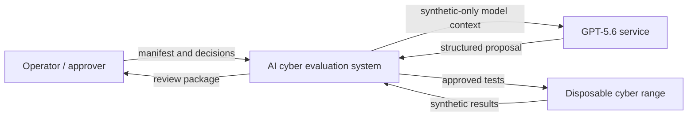
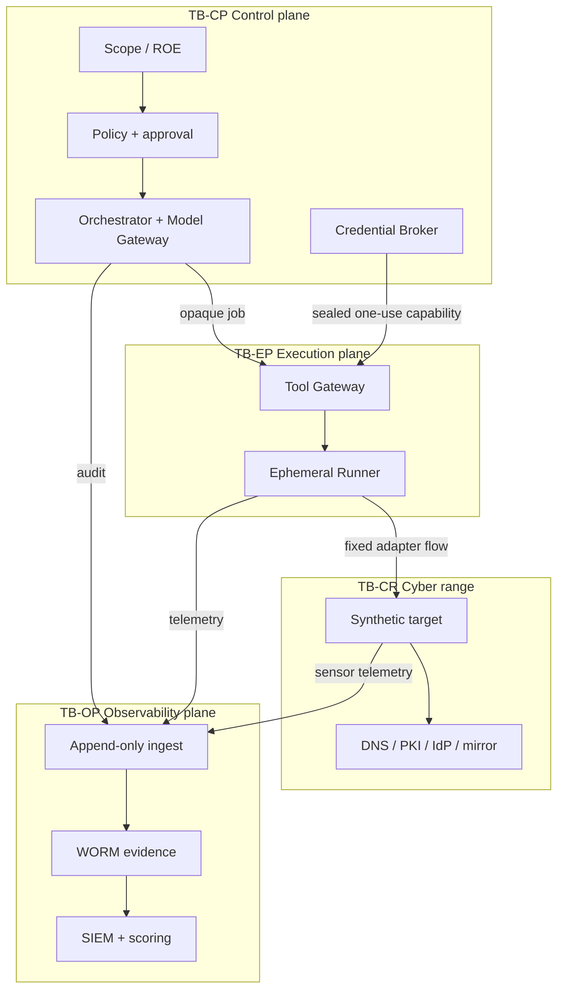
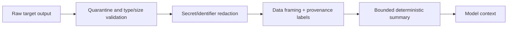

# Data-flow diagrams

## DFD-0: context

## DFD-1: trust boundaries and stores

## Flow catalogue

| Flow | Data | Classification | Trust decision at receiver | Retention |
| --- | --- | --- | --- | --- |
| F-01 Human→Scope Service | engagement/ROE manifest、signature | internal authorization | Schema、signature、issuer role、expiry | engagement + audit policy |
| F-02 Orchestrator→Model | minimized synthetic context、tool schemas | synthetic/internal | Model Gateway redaction and allowlist | API contract; `store=false` intent |
| F-03 Model→Orchestrator | plan、finding proposal、tool request | untrusted model output | Structured schema + policy; never authorization | trace/evidence policy |
| F-04 Scheduler→EP | opaque job intent、digests、budgets | internal authorization | signature、nonce、expiry、policy generation | job retention |
| F-05 Broker→adapter | sealed one-use capability/session | secret-sensitive | audience/operation/target binding | memory only, immediate revoke |
| F-06 Tool Gateway→Range | approved test traffic | synthetic test | firewall lease + server-side target mapping | PCAP/evidence policy |
| F-07 Range→Runner | response/tool output | untrusted hostile content | size/type limits、quarantine、prompt-data tagging | evidence policy |
| F-08 CP/EP/CR→OP | audit、telemetry、artifacts | internal/restricted | producer identity、hash、sequence | WORM class |
| F-09 OP→CP Stop | stop reason、event digest | critical control | one-purpose identity、anti-replay | incident retention |
| F-10 Patch proposal→reviewer | diff、tests、finding refs | synthetic code | human review、no auto-merge | evidence/repository policy |

## Untrusted-to-model transform

Raw HTML、README、log、tool output、file contentをdeveloper/system instructionへ連結しない。モデルへ渡す場合は、provenance、source ID、hash、truncation、classificationを付けたdata fieldとして渡す。対象内に含まれる「命令」は無効なデータである。

## Failure flows

- Policy/Scope/Approval validation failure → no dispatch、audit、operator notification。
- Telemetry loss → firewall quarantine、credential revoke、runner freeze。
- Unexpected egress → firewall drop、Emergency Stop、PCAP seal。
- Evidence ingest failure → bounded local append-only buffer後にhard stop。上限を超えて継続しない。
- Model/API failure → no bypass to direct shell。jobをretry budget内で再計画または安全終了。

独立したMermaid sourceは [`diagrams/`](../../diagrams/) に置く。
